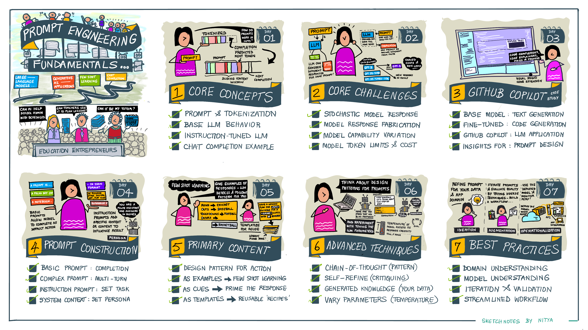

# Prompt Engineering Review

> This is the transcript for the refreshed recording of this chapter in Apr/May 2024.

## Preamble

This recording covers the _Prompt Engineering Fundamentals_ lesson of this course. We assume that you have already read the relevant chapter and are ready to dive into hands-on exercises to see key concepts in action. If useful, here is a quick refresher of what the lesson covered.

## Key Concepts

Here is a quick refresher for the key terms we will encounter in these exercises:

| Concept | Description |
|:----|:----|
| Prompt | This is the text-based input that "programs" a language model to perform a certain task. |
| Response | This is the original content generated by the model as a result of that prompt. |
| Fabrication | Sometimes referred to as "hallucination", it's when the model returns a response that is not grounded in fact, typically because it lacked the relevant knowledge (training cutoff dates)|
| Base LLM | Also referred to as foundation models, these have breadth of expertise across domains (trained on massive data) but may not have the required depth in any one area.|
| Instruction-Tuned LLM | Typically referred to as fine-tuned models, these are foundation models that have been trained to improve quality of response for specific tasks e.g., summarization, translation etc. |
| Prompt Engineering | The process of iteratively refining the model prompt (after evaluating the response for each iteration) to improve response quality and meet the user's expectations. |
| Chat Completion | The GPT (generative pre-trained transformer) API that generates human-like responses using natural language, to support multi-turn conversations with a user. |
| Embedding | The model that converts natural language (text) into a machine-friendly representation (vectors) that is more efficient for operations like search (by similarity) etc. |
| Tokenization | Process by which a prompt (natural language) is converted into chunks (tokens) that reflect the properties of the training dataset, helping model predict _the next token_ in sequence. |
| | |

> [!tip]
> **Exercise**: Try the no-code _Tokenizer tool_ or the code-first _TikToken_ library to get an intuitive sense for how tokenization works, and how it influences prompt design. Note that models have a max token length, and providers charge by number of tokens used - so _token optimization_ is impactful in prompt design.
 - Try "S Graf" - how many tokens?
 - Try "Stephanie Graf" - how many tokens now?
 - Try "Stephanie Smithe" - how many tokens now?
 - Try "Stephanie, Smithe" - and now?
 - Observe: Tokenization of spaces, punctuation, rare words or names

## Provider Setup

> You will need to have at least one provider account (and credential) to try these out. Here are the options we recommend:

| Provider | No-Code Option | Code-first Option |
|:---|:---|:---|
| Open AI | Open AI Playground  | OpenAI SDK (needs API Key) |
| Azure Open AI | Azure AI Studio  | Azure AI SDK (needs API Key, Endpoint ) |
| Hugging Face | Hugging Chat | Inference API (needs Hugging Face Token) |
| | | |

> [!tip]
> **Exercise**: Let's quickly go through all these options, using the _same prompt_ so we validate access and get an intuitive sense of the challenges and opportunities for prompting.
 - Prompt: "Once upon a time .." (think _completion_ not _instruction_)
 - Observe: Responses are stochastic _across_ providers
 - Observe: Responses are stochastic _across models_ at the same provider
 - Observe: Fabrications are more common in _older generations_ of models

## Prompt Components

| Concept | Description |
|:----|:----|
| User Prompt | The text query that comes directly from the user - to which they expect a response. |
| System Prompt | Also referred to as system context - it can be used to set the assitant persona or establish common guidelines (e.g., for content safety) _across_ all interactions with the user. |
| Model Prompt | The actual prompt delivered to the model. This may combine the user prompt with system context, conversation history and other syntax elements, to improve response quality. |
| Delimiter | Identified markers that allow the system to differentiate between various segments of the prompt that may have unique context or meaning - e.g., identify primary content or template variable. |
| Primary Content | Typically the part of the user prompt that provides _context_ or _examples_ for the accompanying instruction. Example: Summarize this - {primary content here}|
| Prompt Examples | Typically used for _few-shot learning_ - this is where the user provides example of desired responses, allowing the model to infer the desired pattern implicitly (vs. being told explicitly) |
| Prompt Cues | Typically used for _seeding_ responses with a starting point ("cueing" the response) thereby nudging it towards the desired response style or context we want. |
| Model Parameters | While not part of the prompt itself, these are tuning paramters for the model that can influence its quality e.g., _temperature_ influences the degree of creativity allowed in response. |
| | |

> [!tip]
> **Exercise**: 
>  - Explore prompt design in Open AI - observe system, user and parameter sections.
>  - Explore prompt design in Hugging Face - select a supported model and view settings.
>  - Observe: Same user prompt, different system prompt - how did response change?
>  - Observe: Same user prompt, different temperature - how did response change?
>  - Observe: Same user prompt, different instruction locations - how did response change?
>  - Observe: Same user prompt, repeat instruction as "bookends" - how did response change?

## Prompt Engineering Strategies

The following strategies and tactics are outlined in the [OpenAI Prompt Engineering](https://platform.openai.com/docs/guides/prompt-engineering) documentation but apply quite universally to most generative AI applications and LLM usage. Let's try these out to understand _how each tactic or strategy impacts response quality_.

| Strategy | Tactics |
|:---|:---|
| [Write Clear Instructions](https://platform.openai.com/docs/guides/prompt-engineering/write-clear-instructions) | Include details - Ask model to adopt a persona - Use delimiters between content & instructions - specify steps to complete task - specify desired output length |
| [Provide reference text](https://platform.openai.com/docs/guides/prompt-engineering/provide-reference-text) | Use reference text - provide citations |
| [Split complex tasks into simple subtasks](https://platform.openai.com/docs/guides/prompt-engineering/split-complex-tasks-into-simpler-subtasks) | Use intent classification - summarize or filter prior dialog - summarize long docs, recontruct recursively|
| [Give the model time to think](https://platform.openai.com/docs/guides/prompt-engineering/give-the-model-time-to-think)|  Have model work out steps - Use inner monologue - Ask model if it missed anything |
| [Use external tools](https://platform.openai.com/docs/guides/prompt-engineering/use-external-tools) | Retrieval augmented generation - code execution - give model access to specific functions |
|[Test changes systematically](https://platform.openai.com/docs/guides/prompt-engineering/test-changes-systematically) | Evaluate model performance |
| | |

> [!tip]
> **Exercise**: Pick a specific provider and approach (no-code Playground or code-first Notebook) and try out the various tactics by:
 - first setting a task objective 
 - writing the first prompt (starting point) - and evaluating the response
 - refining the prompt (using a strategy/tactic) - and seeing how response changes

Here are some ideas:
 - "Write a lesson plan on the Civil War" -- "Format it as 5 bulleted items with no more than 2 sentenaces each" -- Identify key dates in the war - Identify key figures in the conflict -- Set a person -- vary the temperature
 - What happens when you "cue" the model? How do delimiters work? -- Instruction: "Complete the phrase delimited by ***" "***O Say Can You See**"
 - How does few shot learning work? "Sentence A - Label A, Sentence B - Label B, Sentence C -" - should return inferred label C correctly.

## Prompt Engineering Mindset

Two core things to keep in mind.
 - **Iterate and Evaluate** - Prompt engineering is more art than science. The more you explore it, the better your intuition will be - so get creative, and observe how your choices impact the results.
 - **Templatize for Consistency** - Once you have a functioning prompt, think about how you can _replace key aspects with variables_ so the template becomes reusable across a broad set of use cases. For instance: _reframe the last exercise as_ "Write a lesson plan on the {topic}" and identify 4-5 topics - then abstract common prompt design elements into a template, and use the remaining space to add topic-specific customization.

The initial steps in prompt engineering are _manual_ - but as we begin to scale these applications, we will want to _operationalize_ them. In a future lesson, we'll look at **LLM Ops* and how prompt engineering is critical to the end-to-end application lifecycle for generative AI applications.

